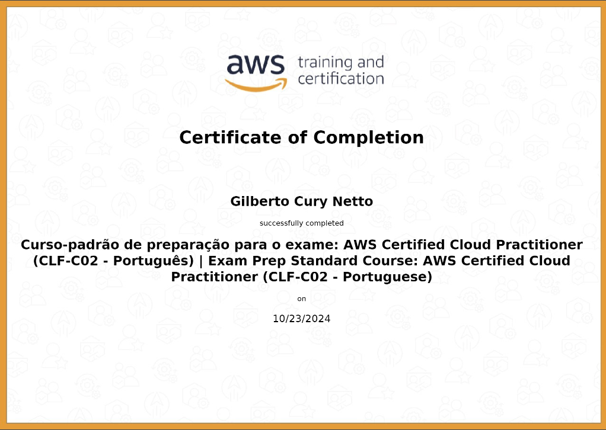

## Breve resumo da Sprint:
### Nessa sprint tivemos um contato mais prático com a AWS, e também um curso preparatório para a prova de certificação.
### Na parte prática tivemos o maior foco no jogo do CloudQuest, que eu considerei extremamente útil na hora de aprender a mexer na AWS, aprendi como criar buckets, gerenciar instâncias, grupos de segurança, entre outras coisas, como o EC2, o S3, o EC2 Image Builder... 
### Então no geral eu gostei bastante do CloudQuest e de trabalhar com AWS.
### No desafio, tive que aprender a criar buckets, fazer conexão com a AWS e enviar arquivos para o Bucket, localmente, utilizando do python(boto3) para isso, confesso que a parte mais desafiadora nesse desafio foi achar um conjunto de dados utilizavel, pois sou bem exigente em relação a isso, mas no fim acabou dando tudo certo.
### Já nos exercícios fizemos algo parecido com o que foi feito no CloudQuest, então não tenho muito a comentar sobre, mas gostei bastante deles no geral.

## Evidências:
### Algumas Evidências que gostaria de destacar:
#### Criando o Bucket com o python:

#### Script de conexão com o s3 e leitura do CSV:

#### Tabelas geradas durante o desafio:

#### Link para a pasta de Evidências:
- [Pasta de Eviências](https://github.com/GilbertoCNetto/GilbertoCNetto-PB_Compass/tree/main/Sprint%2005/Evidencias)

## Exercícios:
#### Bucket Criado:

#### Arquivos carregados:

#### Site Hospedado:

## Certificados:
### Badge do CloudQuest:

- [link_da_badge](https://www.credly.com/badges/647b2329-047a-4159-80cc-b423dae118d7/public_url)
### Certificado do curso preparatório:
