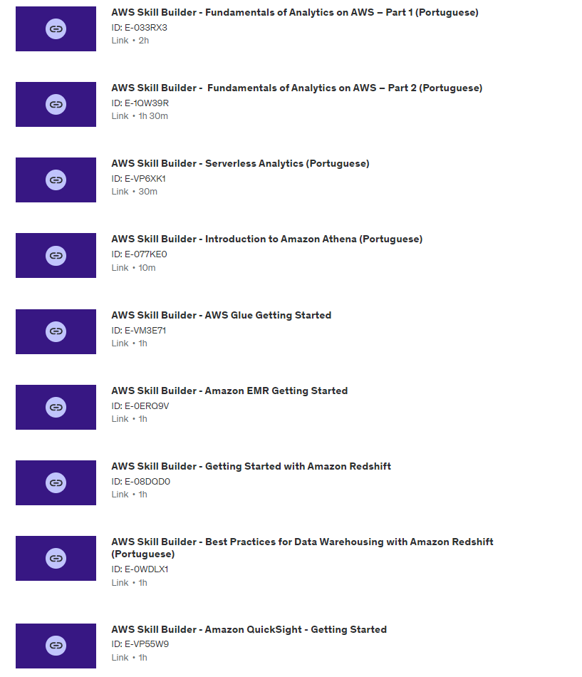

## Breve resumo da Sprint:
### Nessa sprint tivemos mais alguns exercícios para fazer na AWS, que no caso foram utilizando o Athena, e o Lambda, no geral não tive problemas para resolve-los, apenas no do lambda que tive que refazer uma parte, pois ele dava problema depende da versão do python utilizada
### Sobre os cursos da sprint, achei uma ótima introdução para coisas que vamos usar no futuro, me animaram a aprender mais sobre AWS.
### Sobre o desafio, gostei bastante, principalmente por pode reutilizar o docker, pois acho ele bem prático e útil, e também gostei de praticar ainda mais os conceitos da AWS, no geral apresentou um bom nível de dificuldade/recompensa.

## Evidências:
### Algumas Evidências que gostaria de destacar:
#### Dockerfile criado

#### Script do desafio.py:

#### Caminho para o arquivo movies.csv:

#### Caminho para o arquivo series.csv:

#### Link para a pasta de Evidências:
- [Pasta de Eviências](https://github.com/GilbertoCNetto/GilbertoCNetto-PB_Compass/tree/main/Sprint%2006/Evidencias)

## Exercícios:
### Como evidências para os exercícios gostaria de mostrar o resultado de cada um deles.
#### Resultado da query que busca os 3 nomes mais usados por decada:

#### Resultado pedido no exercício obtido com sucesso:

## Certificados:
## Na pasta certificados, tem certificados de todos os 9 cursos que nos foram passados

- [Pasta de Certificados](https://github.com/GilbertoCNetto/GilbertoCNetto-PB_Compass/tree/main/Sprint%2006/Certificado)